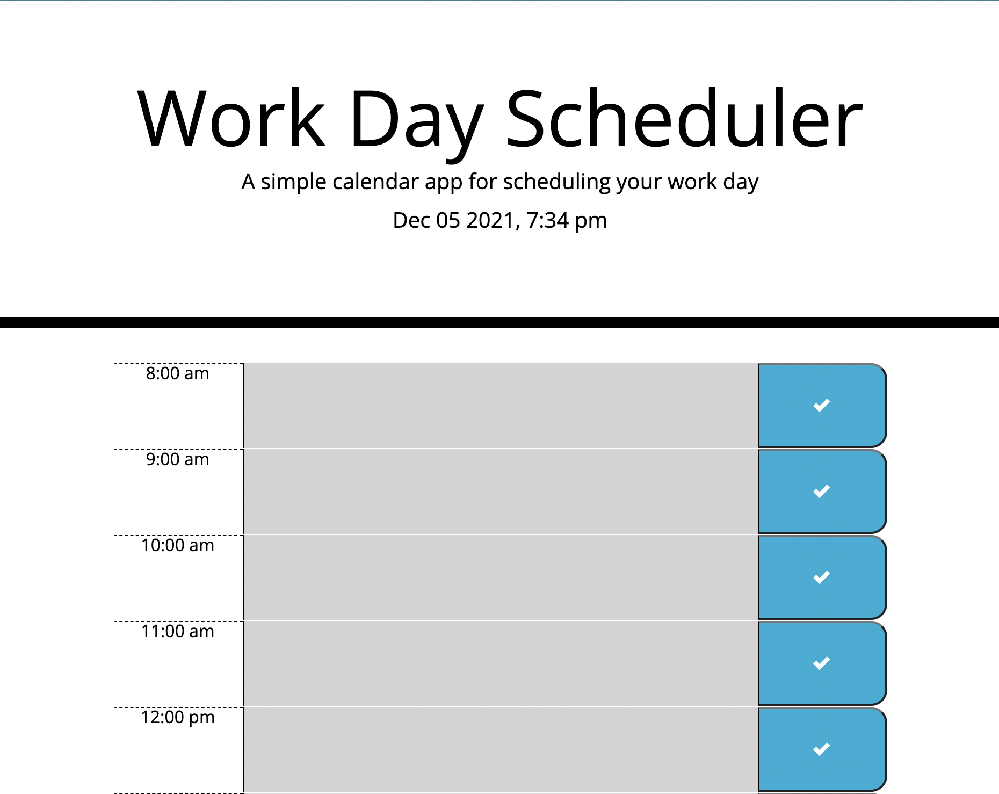

# Work Day Scheduler

## Description
As an employee and student with a busy schedule, I want to add important events to a daily planner so that I can manage my time effectively
## Acceptance Criteria
- When the planner is opened the current day is displayed at the top of the calendar
- When the user scrolls, time blocks appear for working hours
- The user can click a time block and enter an event
- When the save button for that time block is clicked, the text for that event is saved in local storage
- When the page is refreshed the events persist
- Each time block is color-coded to indicate whether it is in the past, present, or future
### Layout

### Link
[Workday Scheduler](https://lexslo.github.io/workday-scheduler/)